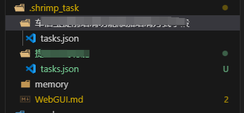
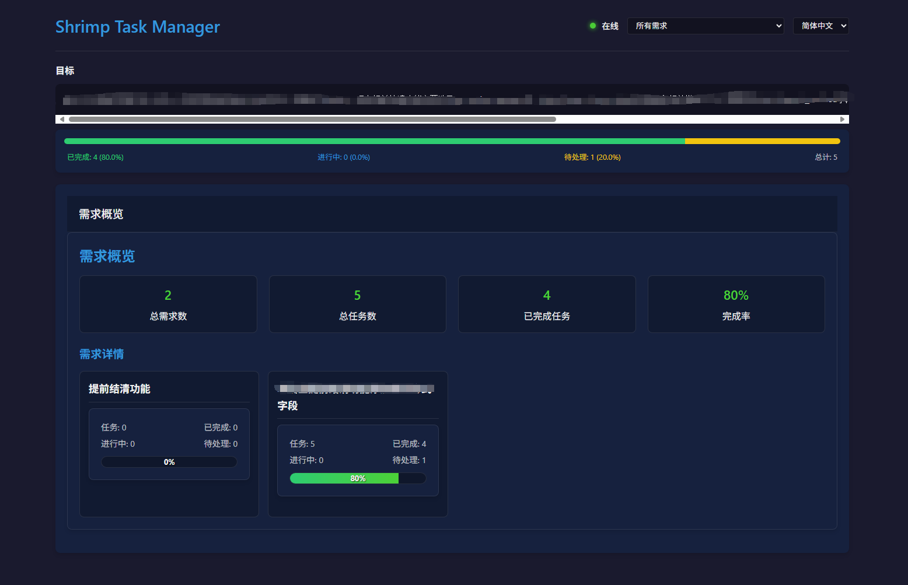

# 变更日志 (CHANGE.MD)

## 项目概述
MCP Shrimp Task Manager - 基于MCP协议的任务管理工具

## 主要变更记录

### 🔧 工具参数优化
- **自动项目路径检测**: 所有需要dataDir参数的工具现在使用`cmd cd`命令自动获取项目路径
- **提示词改进**: 添加"The dataDir parameter required by tools uses cmd to execute cd to obtain the project path"提示，确保AI调用时自动带上项目地址
- **参数一致性**: 统一了所有工具的dataDir参数设计，确保工具调用的一致性

### 📁 数据存储结构重构
- **项目隔离**: 在项目根目录创建`.shrimp_task`目录，实现项目级别的数据隔离
- **需求分层管理**: 支持按需求创建子目录结构，每个需求拥有独立的任务空间
- **目录结构**:
  ```
  .shrimp_task/
  ├── requirement.json          # 需求列表和统计信息
  ├── 需求A/
  │   └── tasks.json           # 需求A的任务列表
  ├── 需求B/
  │   └── tasks.json           # 需求B的任务列表
  └── memory/                  # 记忆文件目录
      └── *.md
  ```

**目录结构示意图**:

*图: 项目目录结构 - 按需求分层管理的文件组织方式*

### 🎯 任务管理功能增强
- **层次化任务结构**: 支持父任务和子任务的层次关系，形成清晰的任务归属
- **需求级别组织**: 任务按需求分组管理，每个需求可包含多个相关任务
- **requirementName必传**: 所有任务必须在指定需求目录下创建，确保数据组织的规范性
- **任务状态跟踪**: 支持任务状态的完整生命周期管理

### 🌐 WebGUI界面改进
- **需求概览页面**: WebGUI.md首先展示所有需求的概览信息
- **分层导航**: 点击具体需求后进入对应的任务列表(Shrimp Task Manager)
- **项目级管理**: 针对每个项目单独管理，可查看该项目下所有需求及相关任务
- **数据展示**: 在WebGUI.md中展示需求列表、任务数、完成数等统计信息
- **交互优化**: 支持需求选择和任务列表的动态加载

**WebGUI界面展示**:

*图: WebGUI管理界面 - 项目级需求和任务管理视图*

### 🔍 功能特性
- **多语言支持**: 优先支持简体中文(zh-CN)本地化
- **路径处理统一**: 所有工具统一使用`.shrimp_task`子目录进行数据存储
- **并发安全**: 支持MCP并发调用时的路径隔离，防止路径冲突
- **自动目录创建**: 当dataDir参数提供时，系统自动创建`.shrimp_task`子目录

### 📋 工具集成
- **任务创建**: 支持创建需求和子任务
- **任务分解**: 支持将复杂任务分解为子任务
- **状态管理**: 支持任务状态的更新和跟踪
- **数据查询**: 支持按需求查询任务列表
- **WebGUI生成**: 自动生成项目级别的Web管理界面

### 🛠 技术改进
- **参数验证**: 增强了工具参数的验证机制
- **错误处理**: 改进了错误处理和用户反馈
- **性能优化**: 优化了数据读写和界面渲染性能
- **代码结构**: 重构了代码结构，提高了可维护性

### 📚 文档更新
- **README.md**: 保持原有功能文档的完整性
- **使用指南**: 更新了工具使用指南和最佳实践
- **API文档**: 完善了工具API的参数说明

## 界面展示

### 📁 目录结构

*项目目录结构 - 展示了按需求分层管理的文件组织方式，包括requirement.json、各需求子目录和memory目录*

### 🌐 WebGUI管理界面

*WebGUI管理界面 - 展示了项目级需求概览和任务管理功能，支持需求选择和任务列表查看*

